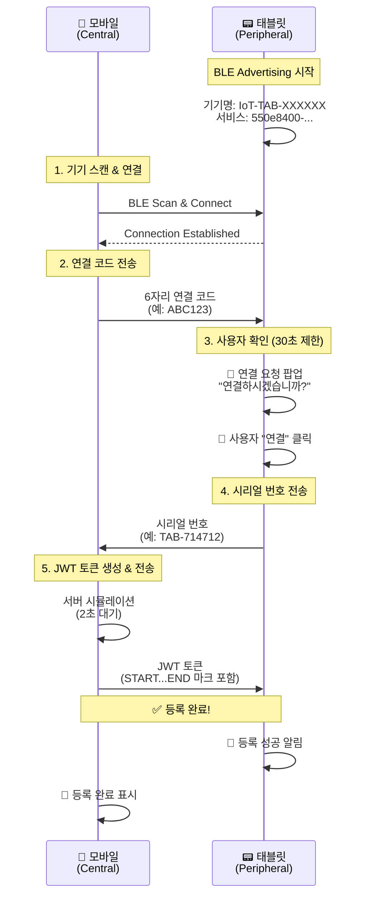

# BLE IoT 기기 등록 시스템

React Native를 사용한 BLE(Bluetooth Low Energy) 기반 IoT 기기 등록 시스템입니다.

태블릿(Peripheral)과 모바일(Central) 간의 양방향 BLE 통신을 통해 안전한 IoT 기기 등록을 구현합니다.

## 🏗️ 시스템 아키텍처

### Central vs Peripheral 역할 분담

| 구분 | 역할 | 디바이스 | 라이브러리 |
|------|------|----------|------------|
| **Central** | BLE Scanner & Client | 📱 모바일 앱 | [react-native-ble-plx](https://github.com/dotintent/react-native-ble-plx) |
| **Peripheral** | BLE Advertiser & Server | 📟 태블릿 (IoT 기기) | [react-native-bluetooth-client](https://github.com/highRPM/react-native-bluetooth-client) (커스텀) |

### 핵심 기능

- ✅ **30초 제한 사용자 확인**: 연결 요청 시 태블릿에서 30초 내 승인 필요
- ✅ **안전한 3단계 인증**: 연결 코드 → 시리얼 번호 → JWT 토큰
- ✅ **실시간 BLE 통신**: Central-Peripheral 양방향 데이터 교환
- ✅ **자동 타임아웃 방지**: BLE 연결 끊김 방지를 위한 시간 관리

## 📋 통신 플로우



## 🔧 기술 스택

### BLE 라이브러리

#### Central (모바일)
- **라이브러리**: `react-native-ble-plx`
- **역할**: BLE 스캐너, 클라이언트 역할
- **기능**: 
  - 주변 BLE 기기 스캔
  - Peripheral에 연결
  - Characteristic에 데이터 쓰기
  - Notification 수신

#### Peripheral (태블릿) 
- **라이브러리**: `react-native-bluetooth-client` (커스텀)
- **원본**: [highRPM/react-native-bluetooth-client](https://github.com/highRPM/react-native-bluetooth-client)
- **역할**: BLE 서버, Advertiser 역할
- **기능**:
  - BLE Advertising 
  - GATT 서비스/특성 관리
  - 클라이언트로부터 데이터 수신
  - Notification 전송

### BLE 서비스 구조

```
📡 BLE Service
├── 🆔 Service UUID: 550e8400-e29b-41d4-a716-446655440000
└── 📝 Characteristic UUID: 550e8401-e29b-41d4-a716-446655440001
    ├── Properties: Read + Write + Notify
    ├── Permissions: Write
    └── 용도: 양방향 데이터 교환
```

## 🚀 시작하기

### 1. 환경 설정

```bash
# 의존성 설치
npm install

# iOS CocoaPods 설치 (iOS만)
cd ios && pod install && cd ..
```

### 2. 권한 설정

#### Android (`android/app/src/main/AndroidManifest.xml`)
```xml
<uses-permission android:name="android.permission.BLUETOOTH_ADVERTISE" />
<uses-permission android:name="android.permission.BLUETOOTH_CONNECT" />
<uses-permission android:name="android.permission.BLUETOOTH_SCAN" />
<uses-permission android:name="android.permission.ACCESS_FINE_LOCATION" />
```

#### iOS (`ios/BleTransferApp/Info.plist`)
```xml
<key>NSBluetoothAlwaysUsageDescription</key>
<string>IoT 기기 등록을 위해 Bluetooth를 사용합니다.</string>
```

### 3. 앱 실행

```bash
# Android
npm run android

# iOS  
npm run ios
```

## 📱 사용 방법

### 태블릿 설정 (Peripheral)
1. 앱 실행 → "태블릿 모드" 선택
2. 자동으로 BLE Advertising 시작
3. 기기명 `IoT-TAB-XXXXXX`로 광고
4. 연결 대기 상태

### 모바일 등록 (Central)
1. 앱 실행 → "모바일 모드" 선택  
2. "IoT 기기 스캔" 버튼 클릭
3. 발견된 `IoT-TAB-XXXXXX` 기기 선택
4. 6자리 연결 코드 입력 후 전송
5. 태블릿에서 30초 내 "연결" 버튼 클릭
6. 자동으로 등록 프로세스 완료

## 🔐 보안 특징

- **3단계 인증**: 연결 코드 → 시리얼 번호 → JWT 토큰
- **시간 제한**: 30초 내 사용자 승인 필요
- **연결 검증**: BLE 연결 상태 지속 모니터링
- **데이터 암호화**: BLE 기본 암호화 + JWT 토큰

## 🛠️ 개발 정보

### 주요 상수
```typescript
BLE_SERVICE_UUID = '550e8400-e29b-41d4-a716-446655440000'
BLE_CHARACTERISTICS = {
  CODE_VERIFY: '550e8401-e29b-41d4-a716-446655440001',
  JWT_TOKEN: '550e8402-e29b-41d4-a716-446655440002', 
  STATUS: '550e8403-e29b-41d4-a716-446655440003'
}
CONNECTION_CODE_LENGTH = 6
CONNECTION_TIMEOUT = 30000 // 30초
```

### 디렉토리 구조
```
src/
├── bluetooth/           # 커스텀 Bluetooth Client 모듈
├── screens/
│   ├── HomeScreen.tsx   # 메인 선택 화면
│   ├── MobileScreen.tsx # Central 모드 (모바일)
│   └── TabletScreen.tsx # Peripheral 모드 (태블릿)
└── utils/
    └── bleManager.ts    # BLE 통신 로직
```

## 🐛 트러블슈팅

### BLE 연결 실패
- Android: 위치 권한 및 Bluetooth 권한 확인
- iOS: Info.plist에 Bluetooth 사용 설명 추가
- 두 기기 모두 Bluetooth가 켜져 있는지 확인

### 30초 타임아웃
- 팝업이 뜨면 빠르게 "연결" 버튼 클릭
- 타임아웃 발생 시 모바일에서 다시 시도

### JWT 토큰 수신 실패  
- BLE 연결이 유지되는지 확인
- 태블릿의 Advertising이 활성 상태인지 확인

## 📄 라이센스

MIT License

## 🙏 크레딧

- **Central BLE**: [react-native-ble-plx](https://github.com/dotintent/react-native-ble-plx)
- **Peripheral BLE**: [react-native-bluetooth-client](https://github.com/highRPM/react-native-bluetooth-client) (커스텀 버전)
