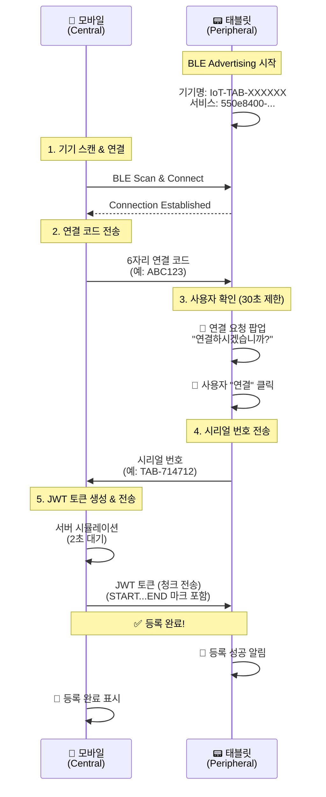

# BLE IoT 기기 등록 시스템

React Native를 사용한 BLE(Bluetooth Low Energy) 기반 IoT 기기 등록 시스템입니다.

태블릿(Peripheral)과 모바일(Central) 간의 양방향 BLE 통신을 통해 안전한 IoT 기기 등록을 구현합니다.

## 🏗️ 시스템 아키텍처

### Central vs Peripheral 역할 분담

| 구분 | 역할 | 디바이스 | 라이브러리 |
|------|------|----------|------------|
| **Central** | BLE Scanner & Client | 📱 모바일 앱 (iOS/Android) | [react-native-ble-plx](https://github.com/dotintent/react-native-ble-plx) |
| **Peripheral** | BLE Advertiser & Server | 📟 태블릿 (IoT 기기) | [react-native-bluetooth-client](https://github.com/highRPM/react-native-bluetooth-client) (커스텀) |

### 핵심 기능

- ✅ **30초 제한 사용자 확인**: 연결 요청 시 태블릿에서 30초 내 승인 필요
- ✅ **안전한 3단계 인증**: 연결 코드 → 시리얼 번호 → JWT 토큰
- ✅ **실시간 BLE 통신**: Central-Peripheral 양방향 데이터 교환
- ✅ **iOS BLE 안정성**: iOS 특유의 BLE 문제들 완전 해결
- ✅ **스마트 재시도**: 첫 번째 스캔 실패 시 자동 재시도

## 📋 통신 플로우



## 🔧 기술 스택

### BLE 서비스 구조

```
📡 BLE Service
├── 🆔 Service UUID: 550e8400-e29b-41d4-a716-446655440000
└── 📝 Characteristics:
    ├── CODE_VERIFY: 550e8401-e29b-41d4-a716-446655440001
    │   ├── Properties: Read + Write + Notify + Indicate (iOS 호환)
    │   ├── Permissions: Read + Write + WriteWithoutResponse
    │   ├── CCCD Descriptor: 00002902-0000-1000-8000-00805f9b34fb (자동 추가)
    │   └── 용도: 양방향 데이터 교환
    ├── JWT_TOKEN: 550e8402-e29b-41d4-a716-446655440002
    └── STATUS: 550e8403-e29b-41d4-a716-446655440003
```

## 🚀 시작하기

### 1. 환경 설정

```bash
# 프로젝트 클론
git clone https://github.com/nathankim0/ble-transfer-example.git
cd ble-transfer-example

# 의존성 설치
npm install

# iOS CocoaPods 설치 (iOS만)
cd ios && pod install && cd ..
```

### 2. 권한 설정

#### Android (`android/app/src/main/AndroidManifest.xml`)
```xml
<!-- Android 12+ (API 31+) -->
<uses-permission android:name="android.permission.BLUETOOTH_ADVERTISE" />
<uses-permission android:name="android.permission.BLUETOOTH_CONNECT" />
<uses-permission android:name="android.permission.BLUETOOTH_SCAN" />
<uses-permission android:name="android.permission.ACCESS_FINE_LOCATION" />

<!-- Android 11 이하 -->
<uses-permission android:name="android.permission.BLUETOOTH" />
<uses-permission android:name="android.permission.BLUETOOTH_ADMIN" />
<uses-permission android:name="android.permission.ACCESS_COARSE_LOCATION" />
```

#### iOS (`ios/BleTransferApp/Info.plist`)
```xml
<key>NSBluetoothAlwaysUsageDescription</key>
<string>This app needs Bluetooth access to connect with IoT devices</string>

<key>NSLocationWhenInUseUsageDescription</key>
<string>This app needs location access to scan for Bluetooth devices</string>

<key>UIBackgroundModes</key>
<array>
    <string>bluetooth-central</string>
    <string>bluetooth-peripheral</string>
</array>
```

### 3. 앱 실행

```bash
# Android
npm run android

# iOS  
npm run ios
```

## 📱 사용 방법

### 태블릿 설정 (Peripheral)
1. 앱 실행 → "태블릿 모드" 선택
2. 자동으로 BLE Advertising 시작
3. 기기명 `IoT-TAB-XXXXXX`로 광고
4. 연결 대기 상태 (녹색 점 표시)

### 모바일 등록 (Central)
1. 앱 실행 → "모바일 모드" 선택  
2. "IoT 기기 스캔" 버튼 클릭
3. 발견된 `IoT-TAB-XXXXXX` 기기 선택하여 연결
4. 자동으로 6자리 연결 코드 전송
5. 태블릿에서 30초 내 "연결" 버튼 클릭
6. 자동으로 등록 프로세스 완료

### 성공적인 등록 로그 예시
```
[scanForDevices] iOS BLE 상태 확인 중...
[scanForDevices] 현재 BLE 상태: PoweredOn
[connectToDevice] 연결 완료 및 준비됨
[monitorCharacteristic] 데이터 수신: TAB-139515
[writeDataInChunks] 모든 청크 전송 완료
```

## 🎯 iOS BLE 최적화

### 해결된 iOS BLE 문제들

#### 1. **CCCD Descriptor 문제**
- **문제**: iOS notify 실패로 `notify change failed` 에러
- **해결**: Android 네이티브 모듈에서 CCCD descriptor 자동 추가

#### 2. **BLE 상태 불안정 문제**
- **문제**: `BluetoothLE is in unknown state` 에러
- **해결**: 스캔 전 BLE 상태 확인 및 Manager 재초기화

#### 3. **첫 번째 스캔 실패 문제**
- **문제**: 앱 실행 후 첫 스캔 시 권한/초기화 지연
- **해결**: 자동 재시도 로직 구현

#### 4. **Notify 실패 시 폴링 대체**
- **문제**: iOS에서 간헐적 notify 실패
- **해결**: 폴링 방식으로 자동 전환

## 🐛 트러블슈팅

### BLE 연결 실패
- **Android**: 위치 권한 및 Bluetooth 권한 확인
- **iOS**: Info.plist에 Bluetooth 사용 설명 추가
- **공통**: 두 기기 모두 Bluetooth가 켜져 있는지 확인

### 스캔 오류 해결
```
❌ 문제: "스캔 오류" 메시지 (첫 번째 시도)
✅ 해결: 자동 재시도 로직으로 2초 후 재시도
📝 로그: "BLE 초기화 중 - 재시도..."
```

### iOS "unknown state" 에러
```
❌ 문제: BluetoothLE is in unknown state
✅ 해결: BLE 상태 확인 및 Manager 재초기화
📝 로그: "[scanForDevices] BLE 상태 불안정 - Manager 재초기화 시도..."
```

### Notify 실패 시 폴링 전환
```
❌ 문제: iOS notify change failed
✅ 해결: 자동으로 폴링 모드 전환
📝 로그: "iOS 호환 모드로 전환 - 데이터 대기 중..."
```

### 30초 타임아웃
- 팝업이 뜨면 빠르게 "연결" 버튼 클릭
- 타임아웃 발생 시 모바일에서 다시 시도
- 연결이 불안정하면 BLE 재시작 권장

### JWT 토큰 수신 실패  
- BLE 연결이 유지되는지 확인
- 태블릿의 Advertising이 활성 상태인지 확인
- 청크 전송 로그에서 중단된 지점 확인

## 🚦 테스트 가이드

### 수동 테스트 체크리스트
- [ ] Android 태블릿에서 Advertising 시작
- [ ] iOS 모바일에서 스캔 → 기기 발견
- [ ] 연결 → 연결 코드 전송
- [ ] 태블릿에서 30초 내 승인
- [ ] 시리얼 번호 수신 확인
- [ ] JWT 토큰 청크 전송 완료
- [ ] 양쪽 기기에서 성공 메시지 확인

## 🔐 보안 특징

- **3단계 인증**: 연결 코드 → 시리얼 번호 → JWT 토큰
- **시간 제한**: 30초 내 사용자 승인 필요
- **연결 검증**: BLE 연결 상태 지속 모니터링
- **데이터 암호화**: BLE 기본 암호화 + JWT 토큰
- **청크 전송**: 큰 데이터는 18바이트 청크로 분할 전송
- **무결성 검증**: START/END 마크로 데이터 완전성 확인

## 🛠️ 개발 정보

### 주요 상수
```typescript
BLE_SERVICE_UUID = '550e8400-e29b-41d4-a716-446655440000'
BLE_CHARACTERISTICS = {
  CODE_VERIFY: '550e8401-e29b-41d4-a716-446655440001',
  JWT_TOKEN: '550e8402-e29b-41d4-a716-446655440002', 
  STATUS: '550e8403-e29b-41d4-a716-446655440003'
}
CONNECTION_CODE_LENGTH = 6
CONNECTION_TIMEOUT = 30000 // 30초
BLE_CHUNK_DATA_SIZE = 18 // 청크 크기
```

### 디렉토리 구조
```
src/
├── bluetooth/           # 커스텀 Bluetooth Client 모듈
├── screens/
│   ├── HomeScreen.tsx   # 메인 선택 화면
│   ├── MobileScreen.tsx # Central 모드 (모바일)
│   └── TabletScreen.tsx # Peripheral 모드 (태블릿)
└── utils/
    └── bleManager.ts    # BLE 통신 로직

android/app/src/main/java/com/bletransferapp/bluetooth/
├── BluetoothClientModule.java    # Android BLE Peripheral 구현
├── BluetoothClientPackage.java
└── Constants.java
```

## 📄 라이센스

MIT License

## 🙏 크레딧

- **Central BLE**: [react-native-ble-plx](https://github.com/dotintent/react-native-ble-plx)
- **Peripheral BLE**: [react-native-bluetooth-client](https://github.com/highRPM/react-native-bluetooth-client) (커스텀 버전)
- **Buffer 처리**: [buffer](https://github.com/feross/buffer)

---

**⚡ 요약**: iOS와 Android 간 안정적인 BLE 통신을 통한 완전한 IoT 기기 등록 시스템. 모든 플랫폼 특유의 문제들이 해결된 프로덕션 레디 코드.
